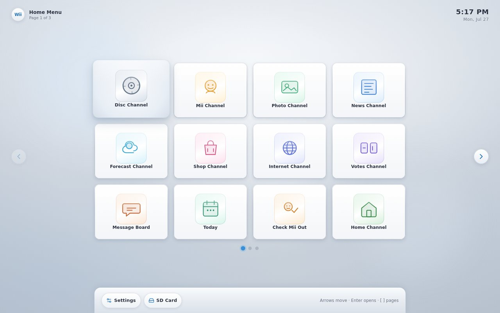
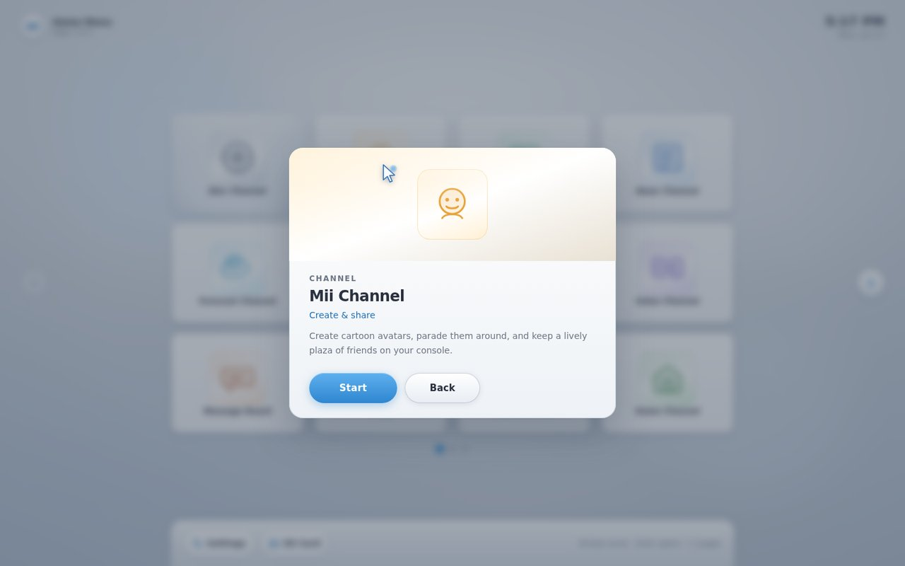
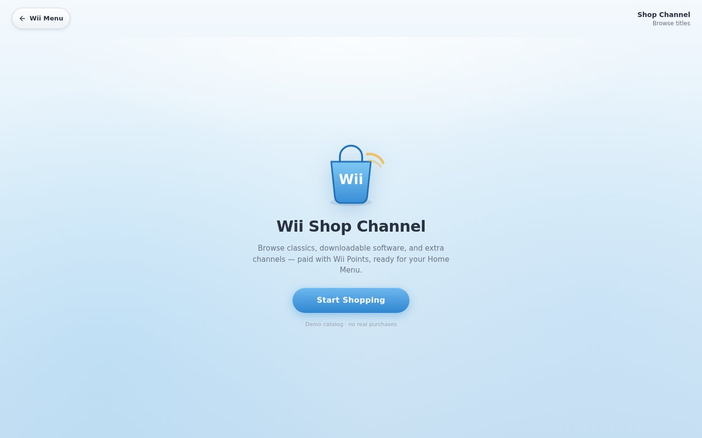
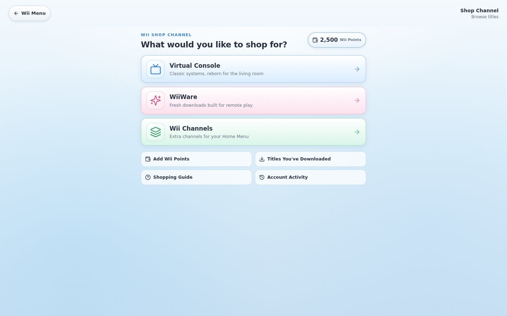
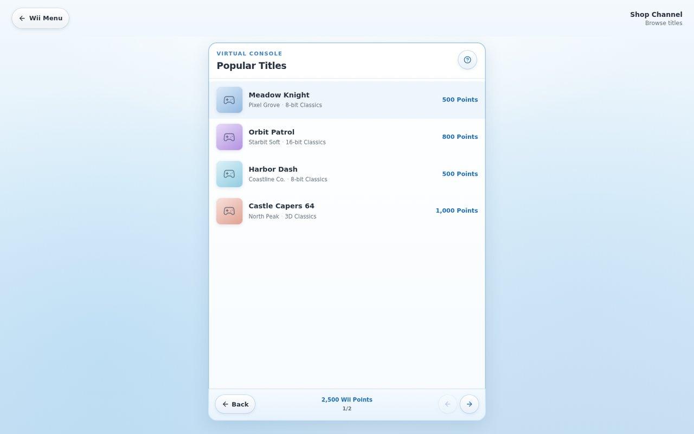
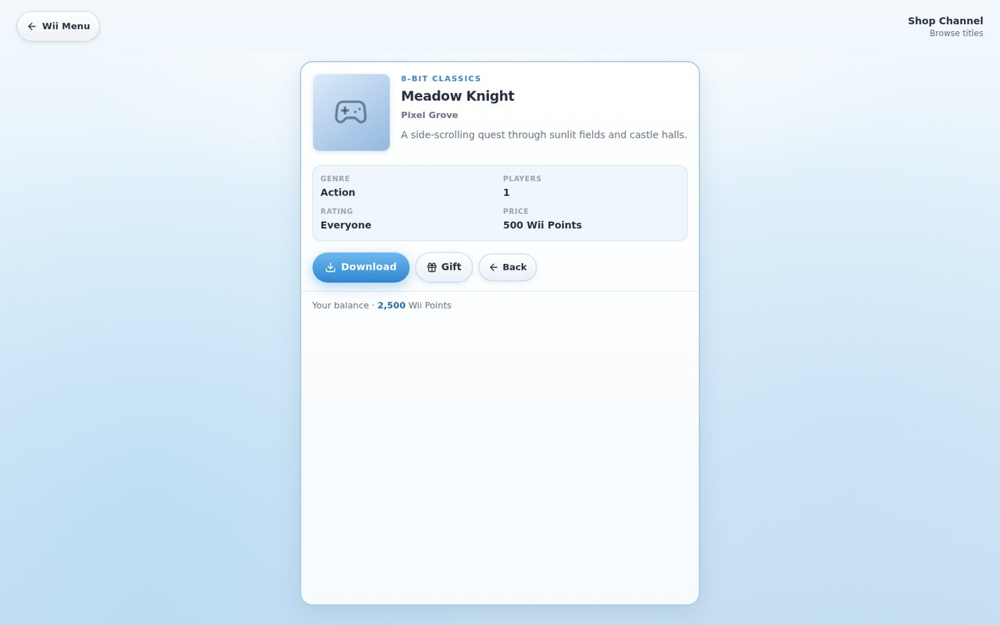
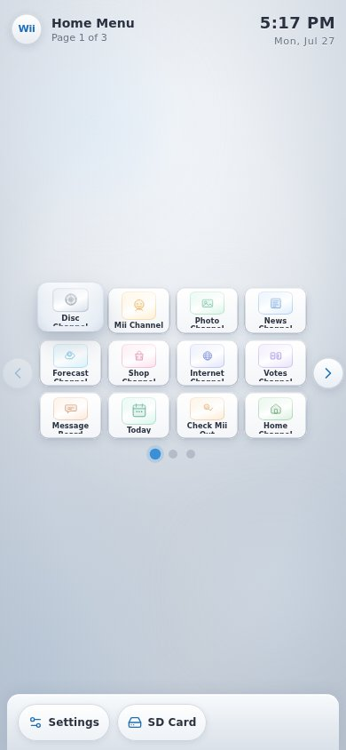

# Wii Home Menu

A polished **fan recreation** of the classic Wii System Menu — soft ambient chrome, multi-page channel grid, pointer cursor, light UI sounds, and a full **Shop Channel** browse flow.

> Not affiliated with Nintendo. Original demo catalog and channel art only.

<p align="center">
  
</p>

<p align="center">
  <em>The Home Menu — channel tiles, page dots, Settings & SD Card bar</em>
</p>

## Features

- Living-room **Home Menu** with a 4×3 channel grid across multiple pages  
- Soft hover focus rings, custom desktop pointer, and Web Audio beeps  
- Keyboard navigation (arrows, Enter, Esc, `[` `]`)  
- Channel experiences: Disc, Mii Plaza, Photo, News, Forecast, Internet, Votes, Message Board, and more  
- **Shop Channel** — Start Shopping → categories → title lists → download with demo Wii Points  
- Responsive layout for desktop and phone  

## Screenshots

### Channel open

<p align="center">
  
</p>

### Shop Channel

| Welcome | Category hub |
| :-----: | :----------: |
|  |  |

| Popular Titles | Title detail |
| :------------: | :----------: |
|  |  |

### Mobile

<p align="center">
  
</p>

## Stack

- React 19 + TypeScript  
- Vite + TanStack Start / Router  
- Tailwind CSS v4  

## Run locally

```bash
npm install
npm run dev
```

App serves on [http://localhost:8080](http://localhost:8080).

```bash
npm run build      # production build
npm run typecheck  # TypeScript
npm test           # vitest unit tests
```

CI (GitHub Actions) runs the same four checks — typecheck, lint, test, build — on every push to `main` and on all pull requests.

## Controls

| Input | Action |
| --- | --- |
| Arrow keys | Move channel focus |
| Enter / Space | Open focused channel |
| Esc | Back / close |
| `[` `]` or page arrows | Previous / next channel page |
| Pointer / touch | Hover, open tiles, Shop navigation |

### Shop flow

1. Open **Shop Channel** → **Start**  
2. **Start Shopping**  
3. Pick **Virtual Console**, **WiiWare**, or **Wii Channels**  
4. Browse **Popular Titles**, open a row, **Download** (demo Wii Points) or **Gift**  

## Project layout

```text
src/
  components/wii/   # Home Menu, channels, Shop Channel
  routes/           # TanStack Start routes
  styles.css        # Design tokens + Wii / Shop chrome
```

## License

Demo / fan project for personal use. Nintendo trademarks and the original Wii design language belong to their owners.
